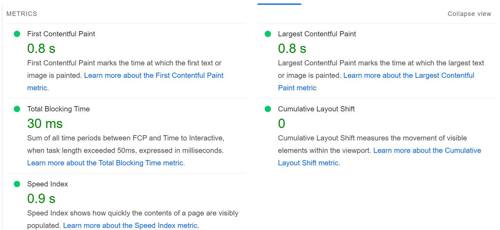
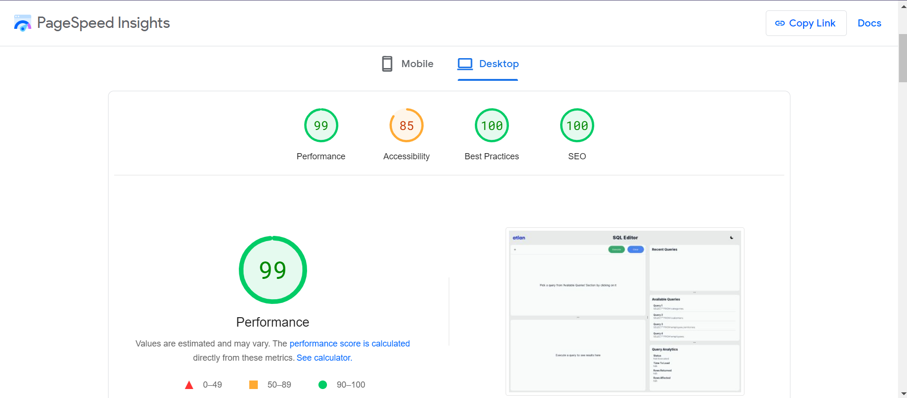
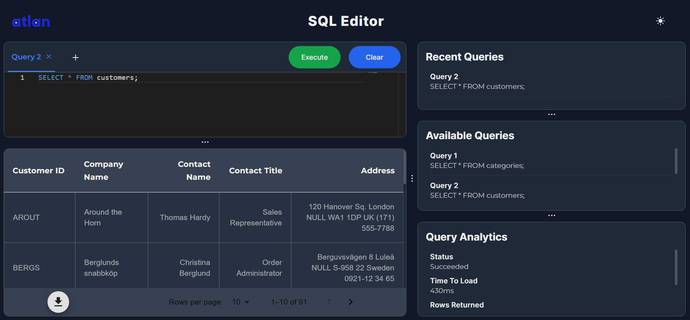
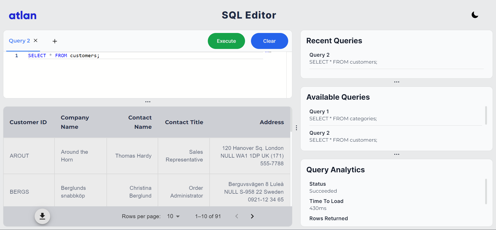

# Atlan Frontend Task:

**Link to the application:  [https://sql-editor-by-atlan.vercel.app/](https://sql-editor-by-atlan.vercel.app/)**

# Overview
The given application is developed as a frontend task for **Atlan** which allows users to interact with an online SQL editor. Users can input and execute SQL queries, then analyze and interpret the obtained results seamlessly within the application.

## Framework, Libraries and Technologies Used
1) Javascript Framework used:  **NextJs 14**.  
 Reasons why I chose NextJs: 
 a) SEO-Friendly and Server-Side Rendering (SSR) 
 b) Efficient Client-Side Routing 
 c) Built-in API Routes 
 d) Optimized Performance 
 e) Built on ReactJs only, and recommended in ReactJs Docs. 
 
2) Major Libraries Used: 
	a) **Material-UI** - For Built-in React components, based on Google's Material Design principles. 
	b) **react-resizable-panels** - For customized and user-friendly layout. 
	c) **react-use-downloader** - For downloading Table data in JSON and CSV format.  
	d) **Monaco** - For Sql code editor, as it is a powerful and feature-rich code editor provided by Microsoft. (also used by VS code) 

3) **Major Features Included:**  
a) **Code Editor** with **SQL support**, **Auto completion**, **Syntax highlighting** and with dark and light theme. 
b) **Pagination**: Application can handle **huge** amounts of data, as the data is divided into pages, also giving the option to change amount of pages per page. 
c) **Downloading of Data:** User can download table data in **JSON** and **CSV** formats  
d)  **Resizable Layout:** Application offers customizable and resizable layout. 
e) **Dark and Light Mode**  
f) **Recent Queries Executed and Analytics section.**  
h) **Skeleton Layout for better User Experience**  

4) **Data:** The data used in the application is obtained from [https://github.com/graphql-compose/graphql-compose-examples/tree/master/examples/northwind/data/csv](https://github.com/graphql-compose/graphql-compose-examples/tree/master/examples/northwind/data/csv), a github repository for mock data.
5) **Available Queries:** 
    `SELECT * FROM order_details;` 
    `SELECT * FROM order` 
    `SELECT * FROM categories;` 
    `SELECT * FROM customers;` 
    `SELECT * FROM employee_territories;` 
    `SELECT * FROM employees;` 

6) **Perfomance Analysis of application:**
Used **Page Speed Insights** (https://pagespeed.web.dev/) for performance analysis 

7) **Optimizations:** 
a) Automatic Code Splitting and Dynamic Imports by NextJs  
b) Image Optimization  
c) Server-Side Rendering (SSR)  

8) **Screenshots** 

   

